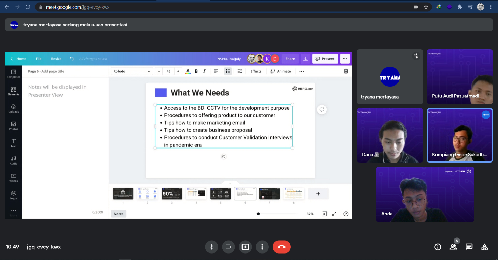
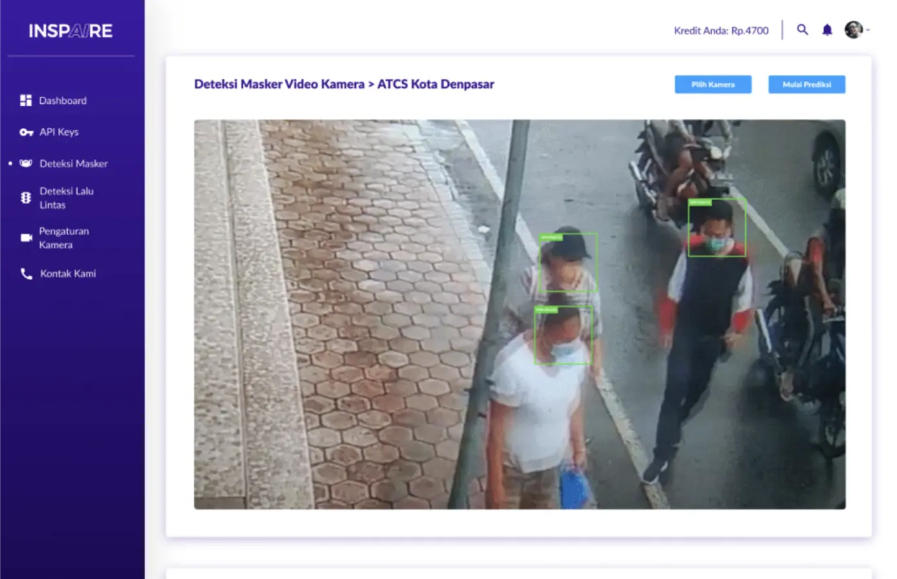
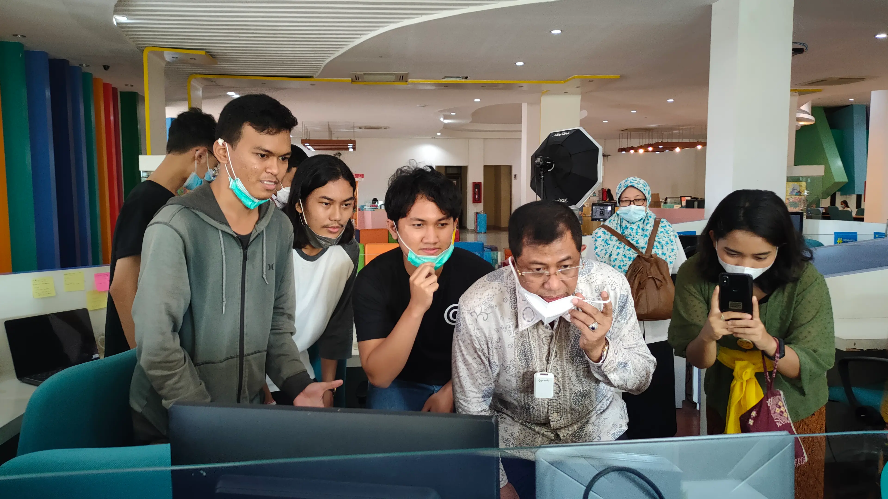
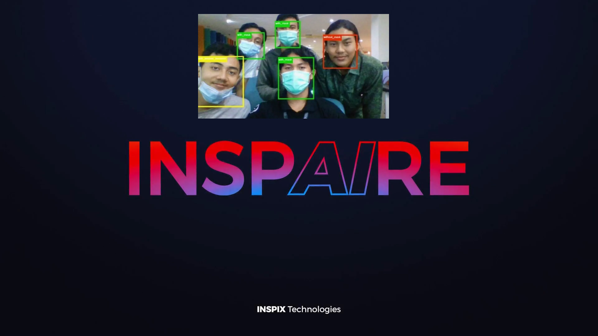

---

draft: false
title: "Inspix Technologies"
description: "Helped companies and government in face-mask regulation during Covid period."
image: "./images/inspix/inspix.jpg"
link: ""
tags: ['react']
createdDate: "2021-08-16"
---
Back in 2021, I participated in a hackathon, won first place, and received incubation from a local incubator. Our startup was Inspix Technologies. Our product was an AI system that could detect face-mask usage and identify people not wearing masks or wearing them improperly.  

At the time, my role was a mix of Product Manager and Frontend Engineer haha, where I managed the team sprints and worked alongside the CEO on product-market fit, market research, and market validation. I also contributed to frontend development by creating our company profile using React.

We successfully implemented it in several companies and a government university to regulate face-mask usage. However, we dissolved the company in late 2021 due to the declining relevance of COVID-19 as new normal policies were introduced.

## Goals
Our goal at that time was to provide a solution for businesses and the government to continue operating normally without violating face mask regulations.

> Inspaire, Our Minimum Viable Product (MVP) 

## Spotlight
We were lucky to be spotlighted by the Ministry of Production Indonesia at that time, which brought significant visibility and attention to our project. It was a great recognition of all our efforts.

> Our team with Ministry of Production Indonesia in our office
## Lesson Learned

> Im the one at the top left, wearing a glass and white shirt hehe 

This is the first time in my life being involved in real-case projects—developing our product, finding market fit, and learning a lot of things along the way, including aspects not directly related to coding.

As developers, there are moments when certain things excite us, like the tech stack we're using, how fast our web server is, or how we architect the app. But the truth is, what we think is important often doesn't matter if users don't want to use it. They don’t care about the technical details behind it. That’s why shipping quickly to find product-market fit is more crucial than perfecting the app or product in the first iteration. Improvements can come later.

Being part of the team, hustling with the boys, makes me feel incredibly lucky. It’s shaped who I am today, and they continue to inspire me